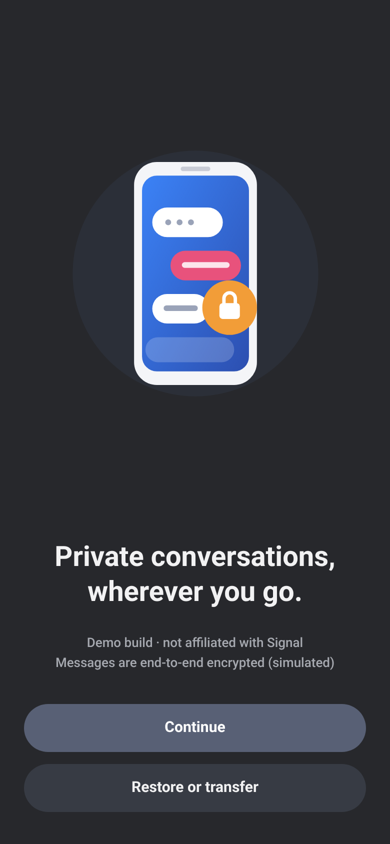
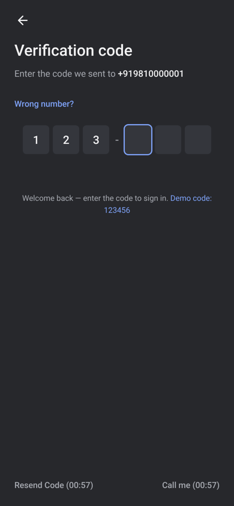
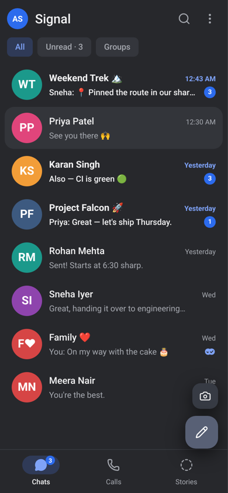
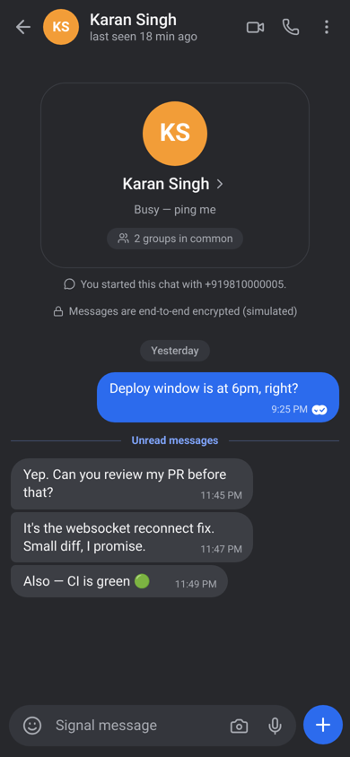
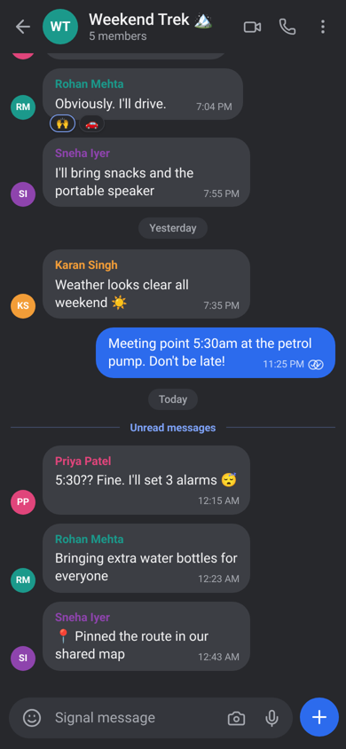
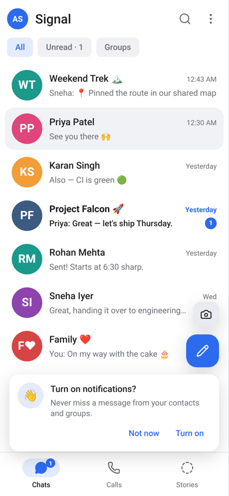
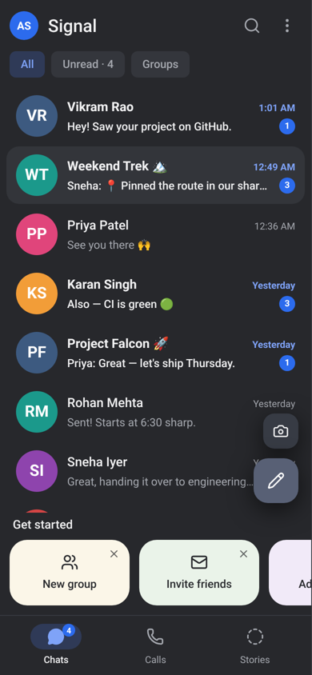
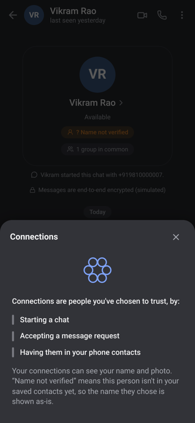
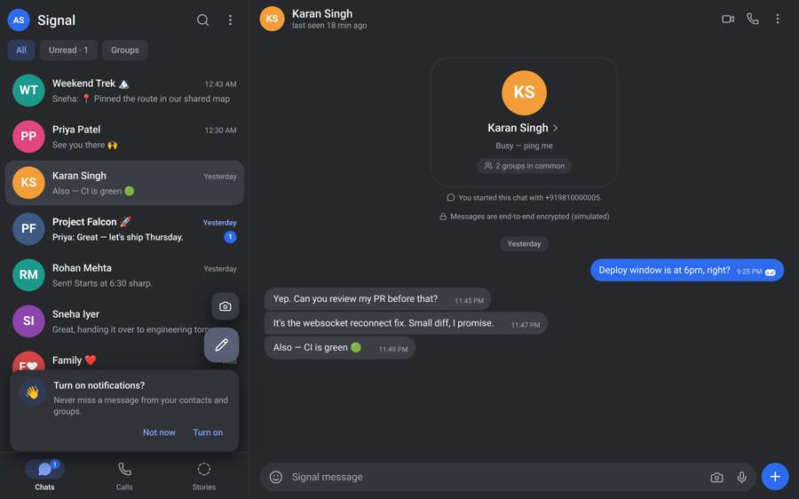

# Signal Clone — Secure Messaging Platform

A Signal-inspired messaging app (UI modelled on Signal for Android): register with a phone number or username (mocked OTP), chat one-on-one or in groups in
**real time**, with delivery/read receipts, typing indicators, search, reactions, replies, attachments, disappearing
messages and dark mode. Built for the Scaler SDE Fullstack assignment.

> Encryption is **simulated** (as permitted by the assignment) and real phone verification is mocked with a fixed OTP.

## Demo

| | |
|---|---|
| Frontend | https://signal-clone-scaler-ai.vercel.app |
| Backend API | https://signal-clone-api-3vcd.onrender.com (`/docs` for Swagger) |
| OTP for every account | **`123456`** |

**Seeded demo accounts** (tap one on the login screen, then enter `123456`):

| Name | Phone | Notes |
|---|---|---|
| Aarav Sharma | `+919810000001` | main demo user — admin of "Weekend Trek", has unread chats |
| Priya Patel | `+919810000002` | admin of "Project Falcon" |
| Rohan Mehta | `+919810000003` | |
| Sneha Iyer | `+919810000004` | |
| Karan Singh | `+919810000005` | |
| Meera Nair | `+919810000006` | admin of "Family" |
| Vikram Rao / Ananya Das | `+919810000007` / `+919810000008` | not in Aarav's contacts — find them via *New message → search* |

### Screenshots (real headless-Chromium captures of this build)

| Welcome | Verification code | Chat list | Conversation |
|---|---|---|---|
|  |  |  |  |

| Group chat | Light mode | Get started cards | "Name not verified" sheet |
|---|---|---|---|
|  |  |  |  |



**Onboarding flow** (mirrors Signal's): welcome → permissions → phone number (+ confirm dialog) → 6-digit code →
*new users:* PIN → profile (first/last name) → app. Returning users skip straight in after the code. The PIN is a UI-only
placeholder (not stored). Bottom navigation: **Chats** (real), **Calls** and **Stories** (mocked placeholders).

**Try real-time:** open the app in two browsers (or one normal + one private window), sign in as Aarav and Priya,
open their chat and watch messages, typing indicators, ticks and online status update live.

## Features

**Core**
- Auth: register (phone *or* username) → mocked OTP → profile (name, avatar colour/photo); login, logout, persistent sessions
- Conversation list sorted by recent activity, unread badges, last-message preview, search (chats, contacts, message text), All/Unread/Groups filters
- Add contacts by searching, or by phone number / username lookup; online & last-seen presence (real, via WebSocket)
- 1:1 chat in real time: timestamps, day separators, `sending → sent → delivered → read` receipts (Signal-style circle ticks), typing indicators, optimistic send with retry, infinite scroll history, unread divider
- Groups: create with name + members, group messages with sender names/avatars, member list, add/remove members, promote/demote admins, rename, leave. **Admin permissions are enforced on the backend (403)**
- Signal experience: sidebar + chat pane, bubble clustering, modals, toasts, empty/loading/error states, mobile layout
- Signal-for-Android navigation: profile → Settings (Account, Appearance with Language and Theme, Chats, Notifications, Privacy, Data and storage, Help, Invite friends), editable Profile (name, About, username) and Edit photo (camera, gallery, text avatar, default avatars), chat-list menu (New group, Mark all read, Filter unread chats, Notification profile, Archived chats, Settings), Signal's own vector icons

**Bonus (all implemented):** dark mode (system/light/dark) · message reactions · reply-to / quoted messages · attachments (images/files, 10 MB) · disappearing messages (per-chat timer, functional server-side expiry) · keyboard shortcuts · delete-for-everyone · responsive layout

**Placeholders ("Coming soon"):** voice/video calls, voice messages, stories, linked devices, screen lock, badges, payments

## Tech stack

| Layer | Choice |
|---|---|
| Frontend | Next.js 16 (App Router) + TypeScript, Tailwind CSS v4, lucide-react icons, Inter font |
| Backend | Python, FastAPI, SQLAlchemy 2, Uvicorn |
| Database | SQLite by default (WAL mode, foreign keys on). The same SQLAlchemy models also run on PostgreSQL, used in production (Neon) so data survives restarts on free hosting |
| Real-time | Native WebSockets (FastAPI/Starlette) |
| Tests | pytest (API + WS), live-server smoke test, Vitest + Testing Library (UI against a live backend) |

## Architecture

```
┌────────────────────────┐   REST (JSON, Bearer token)    ┌──────────────────────────────┐
│ Next.js client (SPA)   │ ─────────────────────────────▶ │ FastAPI                      │
│  AppContext: state,    │                                │  routers/ auth users         │
│  optimistic sends,     │ ◀───────────────────────────── │           conversations      │
│  reconnect + catch-up  │   WebSocket  /ws?token=…       │           search realtime    │
└────────────────────────┘   (server push + typing/read)  │  services.py  domain logic   │
                                                          │  ws_manager.py  live sockets │
                                                          │  SQLAlchemy ▶ SQLite/Postgres│
                                                          └──────────────────────────────┘
```

- **Writes go over REST, fan-out goes over WebSocket.** `POST /conversations/{id}/messages` persists the message,
  creates one receipt row per recipient, and pushes `message.new` to every member's open sockets. REST gives an
  acknowledgement + idempotent retries (`client_id`); the socket gives instant delivery.
- **Receipts are data, not events.** A `message_receipts` row per (message, recipient) holds `delivered_at` / `read_at`.
  Message status is *derived*: `read` if all recipients read, `delivered` if all delivered, else `sent`. Unread counts are
  `COUNT(receipts WHERE read_at IS NULL)`, so the sidebar badge and the ticks can never disagree.
- **Delivered** is set instantly if the recipient has a live socket, otherwise when they next connect (the sender is notified).
  **Read** is set when the recipient opens/views the chat.
- **Reconnect safety:** the client reconnects with exponential backoff and, on every `ready`, refetches conversations and the
  active chat, so nothing is lost while offline. Persisted history is always served from the database.
- **Groups & membership:** one `conversations` table (`type = direct|group`) + `conversation_members` (role `admin|member`).
  Direct chats use a unique `direct_key` (`minId:maxId`) so there can only ever be one DM per pair. New members only see
  history from their `joined_at`. A group can never be left without an admin.
- **Disappearing messages:** `expires_at` is set at send time from the chat's timer; a background task deletes expired rows
  every 2 s (only while some message is waiting to expire, so an idle app lets a serverless database sleep) and pushes `message.expired`; queries also filter expired rows so nothing leaks between sweeps.

## Folder structure

```
backend/
  app/
    main.py            app factory, CORS, lifespan (create tables, seed, expiry sweeper)
    config.py          env-driven settings
    database.py        engine/session, SQLite pragmas
    models.py          schema
    schemas.py         request bodies (pydantic)
    security.py        identifier parsing, sessions, auth dependency
    services.py        serialisers + message/receipt/presence logic shared by REST & WS
    ws_manager.py      per-user socket registry
    seed.py            realistic demo data
    routers/           auth.py users.py conversations.py search.py realtime.py
  tests/               pytest suite + smoke_live.py (live server)
frontend/
  src/app/             layout, page, providers, globals.css (design tokens)
  src/context/         AppContext.tsx — state, REST actions, WebSocket handlers
  src/lib/             api client, types, formatters, config
  src/components/      Sidebar, ChatView, MessageBubble, Composer, AuthScreen, ui primitives
  src/components/modals/  NewChat, NewGroup, Profile, Settings, Info (group admin), ComingSoon
  tests/               Vitest + Testing Library integration tests
scripts/run_integration.py   hermetic end-to-end runner
render.yaml                  Render blueprint for the backend
```

## Local setup

Prerequisites: Node 20+ (tested on 22), Python 3.11+ (tested on 3.13), Git.

**Backend** (PowerShell on Windows shown; use `source .venv/bin/activate` on macOS/Linux)
```powershell
cd backend
python -m venv .venv
.\.venv\Scripts\Activate.ps1
pip install -r requirements-dev.txt
uvicorn app.main:app --reload --port 8000
```
The SQLite file (`backend/signal.db`) is created and seeded automatically on first start. Delete it to reset the demo data. To use PostgreSQL instead, set `DATABASE_URL` (see below); tables are created automatically.

**Frontend**
```powershell
cd frontend
npm install
copy .env.example .env.local      # NEXT_PUBLIC_API_URL=http://localhost:8000
npm run dev                       # http://localhost:3000
```

### Environment variables

| Variable | Where | Default | Purpose |
|---|---|---|---|
| `NEXT_PUBLIC_API_URL` | frontend | `http://localhost:8000` | Backend base URL (WebSocket URL is derived: `http→ws`, `https→wss`) |
| `NEXT_PUBLIC_WS_URL` | frontend | derived | Optional explicit WebSocket base URL |
| `CORS_ORIGINS` | backend | `*` | Comma-separated allowed origins (auth is bearer-token, no cookies) |
| `DATABASE_URL` | backend | `sqlite:///backend/signal.db` | SQLAlchemy URL. Production uses a Neon PostgreSQL URL (`postgresql://…?sslmode=require`) |
| `UPLOAD_DIR` | backend | `backend/uploads` | Where attachments are stored |
| `FIXED_OTP` | backend | `123456` | The mocked verification code |
| `SEED_DEMO_DATA` | backend | `1` | Seed demo users/chats on an empty DB |

## Testing

```bash
cd backend && pytest                       # 20 API + WebSocket tests (in-process)
cd frontend && npm run typecheck && npm run lint
python scripts/run_integration.py          # boots a fresh backend, then runs:
                                           #   • 26-check live smoke test (real HTTP + real WebSockets)
                                           #   • 19 UI integration tests (real React app ↔ live backend)
```
The suites cover: register → OTP → login → refresh → logout; A → B real-time message, persistence, sent → delivered → read,
typing indicators; offline delivery upgrading on reconnect; group create / add / send / remove with admin enforcement;
search; reactions / replies / delete / disappearing / attachments; CORS preflight; WebSocket auth rejection.

## Database schema

```
users(id PK, phone UNIQUE NULL, username UNIQUE NULL, display_name, about, avatar_color, avatar_url, created_at, last_seen_at)
        CHECK (phone IS NOT NULL OR username IS NOT NULL)
sessions(token PK, user_id FK→users, created_at, expires_at)
contacts(id PK, owner_id FK→users, contact_id FK→users, UNIQUE(owner_id, contact_id), CHECK owner≠contact)
conversations(id PK, type CHECK IN('direct','group'), name, avatar_color, created_by FK, direct_key UNIQUE,
              disappear_after, created_at, updated_at INDEX)
conversation_members(id PK, conversation_id FK CASCADE, user_id FK CASCADE, role CHECK IN('admin','member'),
              joined_at, UNIQUE(conversation_id, user_id), INDEX(user_id))
messages(id PK, conversation_id FK CASCADE, sender_id FK, kind CHECK IN('text','system'), body, reply_to_id FK→messages,
              attachment_url/name/type/size, client_id, is_deleted, created_at, expires_at INDEX,
              INDEX(conversation_id, id))
message_receipts(id PK, message_id FK CASCADE, user_id FK CASCADE, delivered_at, read_at,
              UNIQUE(message_id, user_id), INDEX(user_id, read_at))
reactions(id PK, message_id FK CASCADE, user_id FK CASCADE, emoji, UNIQUE(message_id, user_id))
```
"Groups" are `conversations` with `type='group'`; group membership and admin roles live in `conversation_members.role`.
`system` messages record events ("Aarav added Priya").

## API overview

All endpoints except `/api/auth/*` and `/api/health` need `Authorization: Bearer <token>`. Interactive docs: `/docs`.

| Area | Endpoints |
|---|---|
| Auth | `POST /api/auth/request-otp` · `/login` · `/register` · `/logout` · `GET /api/auth/demo-users` |
| Profile | `GET/PATCH /api/me` · `POST /api/uploads` |
| Contacts | `GET/POST /api/contacts` · `DELETE /api/contacts/{id}` · `GET /api/users/search?q=` · `GET /api/users/{id}` |
| Conversations | `GET /api/conversations` · `POST /api/conversations/direct` · `POST /api/conversations/group` · `GET/PATCH /api/conversations/{id}` |
| Members (admin) | `POST /api/conversations/{id}/members` · `PATCH/DELETE /api/conversations/{id}/members/{uid}` (self-delete = leave) |
| Messages | `GET/POST /api/conversations/{id}/messages` · `POST /api/conversations/{id}/read` · `POST /api/messages/{id}/reactions` · `DELETE /api/messages/{id}` |
| Search | `GET /api/search?q=` (chats, contacts, message text) |
| Health | `GET /api/health` |

## WebSocket events

Connect to `/ws?token=<session token>` (invalid token → close code `4401`).

| Direction | Event | Payload | Producer → Consumer |
|---|---|---|---|
| S→C | `ready` | `user_id, online_user_ids` | on connect → client refetches state |
| S→C | `message.new` | `message` | message create → all members |
| S→C | `message.updated` | `message` | reaction / delete → all members |
| S→C | `message.status` | `conversation_id, updates[{id,status,receipts}]` | delivered/read → original sender |
| S→C | `message.expired` | `conversation_id, message_ids` | expiry sweeper → members |
| S→C | `conversation.updated` | `conversation` | create/rename/members/timer → members |
| S→C | `conversation.removed` | `conversation_id` | removed/left → that user |
| S→C | `conversation.read` | `conversation_id` | read → the reader's other tabs |
| S→C | `typing` | `conversation_id, user_id, name, is_typing` | relayed to other members |
| S→C | `presence` | `user_id, online, last_seen_at` | connect/disconnect → people who share a chat |
| C→S | `typing` | `conversation_id, is_typing` | composer → server |
| C→S | `read` | `conversation_id` | viewing a chat → server |
| C→S | `ping` / S→C `pong` | | keep-alive (25 s) |

## Deployment

WebSockets need a long-lived server process, so the backend is **not** a serverless function. Recommended split:

1. **Backend → Render** (supports WebSockets). Push the repo to GitHub, then *New → Blueprint* and select the repo
   (`render.yaml` is picked up). Set `CORS_ORIGINS` to your frontend URL once known. Verify `https://<api>.onrender.com/api/health`.
2. **Frontend → Vercel.** Import the repo, set **Root Directory = `frontend`**, add env var
   `NEXT_PUBLIC_API_URL=https://<api>.onrender.com`, deploy. (`https` automatically becomes `wss` for the socket.)
3. Update the backend's `CORS_ORIGINS` to the Vercel URL and redeploy/restart the API.

3. **Database → Neon (free PostgreSQL), optional but recommended on free hosting.** Create a project in the **same region as the
   backend** (cross-region queries make every screen slow), copy the pooled connection string and add it to Render as
   `DATABASE_URL` (never commit it). Without it the app falls back to SQLite, which Render's free plan wipes on each restart.
4. **Keep-alive.** Render's free plan sleeps after ~15 min idle (first request takes ~30–60 s). A free uptime monitor
   (UptimeRobot, HEAD/GET every 5 min on `/api/health`) keeps it awake. The health route does not touch the database, so Neon can still sleep.

Uploaded files (avatars, attachments) live on the backend's local disk and are still lost on restart on the free plan;
object storage (e.g. Cloudflare R2) or a persistent disk would fix that.

## Assumptions

- Phone numbers must include a country code; usernames are 3–24 chars `[a-z0-9_.]`.
- The OTP is fixed (`123456`) and shown in the UI — verification is mocked per the assignment.
- The assignment names SQLite: it is the default and what the tests use. Production runs the same models on PostgreSQL purely so data persists on free hosting.
- Sessions are opaque random tokens stored in the database (30-day expiry) and kept in `localStorage`.
- "Online" means at least one open WebSocket; "last seen" is the last disconnect.
- Group members only see messages from when they joined.

## Limitations

- End-to-end encryption is simulated (UI copy only); messages are stored in plaintext.
- Sending uses REST (needs connectivity); there is no offline outbox — failed sends show a retry action.
- Single-process, single-instance design (in-memory socket registry). Scaling out would need a pub/sub backplane (e.g. Redis).
- Uploads are stored on local disk and served unauthenticated by (unguessable) URL.
- Notifications are in-app toasts plus browser notifications when the tab is hidden and permission is granted.
- Calls, voice messages, stories and linked devices are placeholders.
- Any signed-in user can look up any other user by name, number or username (no privacy/discoverability settings), and the WebSocket token travels in the query string (browsers cannot set headers on WebSockets) — both acceptable for a demo, not for production.
- No rate limiting or OTP attempt limits (the OTP is fixed by design); real SMS verification would plug in at `/api/auth/request-otp` + `/login`.
- Conversation list builds each row with several queries (N+1); fine for demo-sized data, would need batching/denormalised `last_message_id` at scale.
- Uploaded files are lost on restart on the free Render plan — see Deployment.
- Archived chats, the Language choice and the Get-started cards are stored in the browser (localStorage), not the database, so they don't follow you across devices. The Language setting saves the choice but the interface is English only.
- Delete Account asks for the phone number and signs you out but does not erase server data.
- Settings toggles (notifications, privacy, etc.) are saved in the browser as preferences; most are placeholders and do not change server behaviour.
